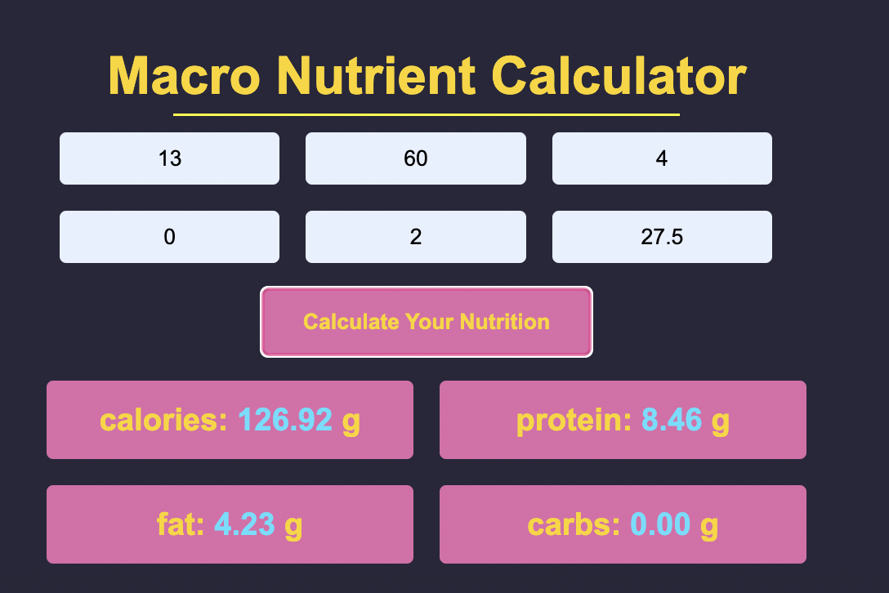

# macro-nutrition-calculator

## Description

[Deployed application 🚀](https://hope428.github.io/macro-nutrition-calculator)

This is a handy little calculator to help health-concious people get accurate information on their calories, protein, carbs, and saturated fat of the food they are eating. Just copy the information from the food label and input how many grams of food you had, and the calculator will do the rest

## Screenshot

